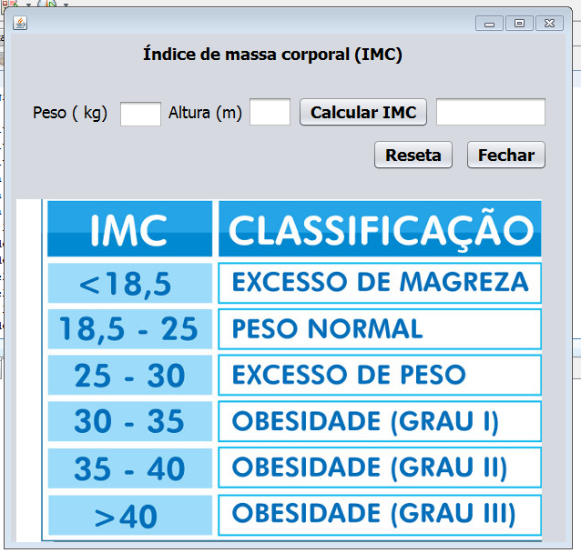

# Indice-de-Massa-Corporal-IMC-
IMC é a sigla para **Índice de Massa Corporal** que serve para avaliar o peso do indivíduo em relação à sua altura e assim indicar se está dentro do peso ideal, acima ou abaixo do peso desejado.

## Cálculo 
O IMC é determinado pela divisão da massa do indivíduo pelo quadrado de sua altura, em que a massa está em quilogramas e a altura em metros.

